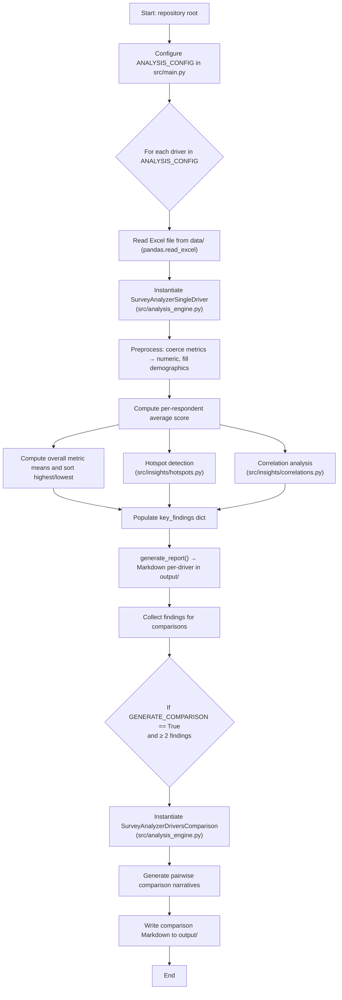

# Drivers Insights — Automated Survey Analysis

Lightweight, configurable pipeline to analyze employee survey "drivers" (e.g., Vision, Communication, Leadership), generate narrative insights per driver, and produce pairwise comparison reports that surface reinforcing loops, likely root causes, and targeted recommendations.

## Table of contents

- Overview
- Requirements
- Quick start
- Configuration
- Data format
- Outputs
- Project structure
- AI helpers (optional)
- Key files
- Extending the project
- Troubleshooting
- License & contact

## Overview

This repository provides a compact, easy-to-adapt pipeline that:

- reads survey response data from Excel files placed in the [`data/`](data/) directory
- computes per-respondent and per-metric statistics
- detects hotspots and performs correlation analysis
- generates human-readable Markdown reports per driver
- optionally produces pairwise comparison narratives across drivers

The core orchestration and configuration live in [`src/main.py`](src/main.py), and the analysis logic is implemented in [`src/analysis_engine.py`](src/analysis_engine.py) using helpers in [`src/insights/`](src/insights/).

## High-level workflow (Mermaid)

Render in a Markdown viewer that supports Mermaid (GitHub, VS Code with the Markdown Preview Mermaid extension).

## What's new

- Optional AI helper package for summarization and Q&A: see [`ai_agent/`](ai_agent/) and the model stub at [`ai_agent/model.py`](ai_agent/model.py).
- Configuration and recommendation templates are now defined in [`src/main.py`](src/main.py); RECOMMENDATION_MAP provides reusable recommendation themes.
- df_qcode mapping includes driver context (e.g., columns such as 'driver', 'qcode', 'question'); agents and reporting are driver-aware: mean scores, correlations, and narratives include driver context.
- Pipeline improvements:
  - Handles missing input files gracefully (skips the driver and inserts a placeholder error entry).
  - Automatically creates the [`output/`](output/) directory if it does not exist.
- AI flows and the pipeline support specifying multiple drivers at once in agent workflows:
  - Retriever calls and vector DB inserts are performed per driver to enable driver-scoped retrieval later.

## Requirements

- Python 3.9+ (tested with Python 3.10+)
- pip-installed dependencies:
  - pandas
  - numpy
  - openpyxl

Optional (only if you use AI helpers):
- An LLM client (OpenAI or local) and credentials configured in [`ai_agent/model.py`](ai_agent/model.py).

## Quick start

1. Create and activate a Python virtual environment (recommended).
2. Install required packages:
   - `pip install pandas numpy openpyxl`
3. Add your Excel files to the repository [`data/`](data/) directory.
4. Configure drivers in [`src/main.py`](src/main.py).
5. Run the pipeline:
   - `python src/main.py`
6. Inspect generated Markdown files in the [`output/`](output/) directory.

## Configuration

Primary configuration lives in [`src/main.py`](src/main.py). Edit the ANALYSIS_CONFIG list and top-level flags such as GENERATE_COMPARISON. Each ANALYSIS_CONFIG entry typically defines:

- driver_name: label for the driver (e.g., "Vision and Direction", "Communication")
- data_file: path under [`data/`](data/) to the Excel file
- metric_columns: list of metric column names to analyze
- metric_themes: mapping from metric column → recommendation theme (used to generate actionable recommendations)
- Optional thresholds and driver-specific settings (extendable in your local fork)

Recommendations are driven by RECOMMENDATION_MAP themes (e.g., leadership_trust, manager_support, resource_allocation, vision_clarity, communication_effectiveness). See [`src/main.py`](src/main.py) for template text.

## Data format

- Input files are Excel (.xlsx).
- df_qcode mapping:
  - The first row in the Excel sheet is read as a raw question/qcode mapping via `header=None` and is used to build driver-aware question mappings.
- Response data:
  - The main DataFrame is read with `skiprows=1` (rows = responses; columns = metrics and optional demographics).
- Required fields:
  - one or more metric columns (numeric or coercible to numeric)
- Optional fields:
  - demographic columns (e.g., Function, Job Level, Sub-Function) for subgroup analysis

Preprocessing is handled by helpers in [`src/insights/data.py`](src/insights/data.py).

## Outputs

- Per-driver Markdown reports written to [`output/`](output/):
  - Summary statistics (means, top/bottom metrics)
  - Hotspot detection (by Function, Job Level, and per-metric Function-level)
  - Correlation analysis (heatmap-friendly formatting)
  - Key findings and suggested recommendations (theme-aware)
- Pairwise comparison reports (if GENERATE_COMPARISON is True and ≥ 2 valid driver findings):
  - Files named `comparison_{driver_a}_vs_{driver_b}.md` in [`output/`](output/)
  - Narrative covers reinforcing loops, vicious cycles, shared demographics, and unified recommendations, generated by `SurveyAnalyzerDriversComparison` in [`src/analysis_engine.py`](src/analysis_engine.py)

## Project structure

- Core pipeline
  - [`src/main.py`](src/main.py) — orchestration, configuration, and I/O
  - [`src/analysis_engine.py`](src/analysis_engine.py) — `SurveyAnalyzerSingleDriver` and `SurveyAnalyzerDriversComparison`
  - [`src/insights/hotspots.py`](src/insights/hotspots.py) — hotspot and bright spot calculations
  - [`src/insights/correlations.py`](src/insights/correlations.py) — correlation matrix and formatting
  - [`src/insights/data.py`](src/insights/data.py) — preprocessing and qcode mapping
  - [`src/insights/findings.py`](src/insights/findings.py) — executive summary, key observations, and recommendations text
- Optional AI helpers
  - [`ai_agent/main.py`](ai_agent/main.py), [`ai_agent/model.py`](ai_agent/model.py), [`ai_agent/schemas.py`](ai_agent/schemas.py)
  - Agents: [`ai_agent/agents/master_agent.py`](ai_agent/agents/master_agent.py), [`ai_agent/agents/qna_summary_agent.py`](ai_agent/agents/qna_summary_agent.py), [`ai_agent/agents/summarizer_agent.py`](ai_agent/agents/summarizer_agent.py)
  - Graphs: [`ai_agent/graphs/summarizer_graph.py`](ai_agent/graphs/summarizer_graph.py), [`ai_agent/graphs/summarizer_graph.png`](ai_agent/graphs/summarizer_graph.png)
  - RAG utils: [`ai_agent/utils/rag/embeddings_model.py`](ai_agent/utils/rag/embeddings_model.py), [`ai_agent/utils/rag/retriever.py`](ai_agent/utils/rag/retriever.py)
  - Examples/tests: [`ai_agent/test_scripts/insights_tools.py`](ai_agent/test_scripts/insights_tools.py)
- Other helpful files
  - [`ai_models.py`](ai_models.py) — local model utilities (if applicable)
  - [`vector_db/`](vector_db/) — vector DB helpers, e.g., [`vector_db/create_db_collection.py`](vector_db/create_db_collection.py), [`vector_db/insert_data.py`](vector_db/insert_data.py)
  - [`test_codes/`](test_codes/) — small test scripts, e.g., [`test_codes/run_agent.py`](test_codes/run_agent.py), [`test_codes/get_columns_names.py`](test_codes/get_columns_names.py), [`test_codes/load_responses.py`](test_codes/load_responses.py)
  - Visuals: [`images/main.png`](images/main.png), [`Summarizer Agent Flowchart.png`](Summarizer Agent Flowchart.png), [`Summarizer Agent Flowchart.drawio`](Summarizer Agent Flowchart.drawio)

## AI helpers (optional)

The AI-assisted toolset under [`ai_agent/`](ai_agent/) is designed as lightweight, pluggable helpers that can summarize findings, run Q&A chains against reports, and support RAG workflows.

- Entrypoint and orchestration:
  - [`ai_agent/main.py`](ai_agent/main.py) — example runner for AI flows and integration tests
- Model interface and configuration:
  - [`ai_agent/model.py`](ai_agent/model.py) — model abstraction and configuration stub (swap in OpenAI, local LLMs, or other clients)
  - [`ai_agent/schemas.py`](ai_agent/schemas.py) — data schemas used by agents/model interfaces
- Agents (task-specific helpers):
  - [`ai_agent/agents/master_agent.py`](ai_agent/agents/master_agent.py) — orchestrates multi-step agent workflows
  - [`ai_agent/agents/qna_summary_agent.py`](ai_agent/agents/qna_summary_agent.py) — generates Q&A and summary outputs from insights; accepts a list of drivers and performs per-driver retrievals before composing answers
  - [`ai_agent/agents/summarizer_agent.py`](ai_agent/agents/summarizer_agent.py) — simple summarization agent used by tests and example flows; expects df_qcode rows to include driver context and produces driver-aware outputs
- Graphs and visual helpers:
  - [`ai_agent/graphs/summarizer_graph.py`](ai_agent/graphs/summarizer_graph.py) — example graph for pipeline-style summarization; inserts one vector DB record per driver when multiple drivers are provided
  - [`ai_agent/graphs/summarizer_graph.png`](ai_agent/graphs/summarizer_graph.png) — visual reference
- Utilities and RAG helpers:
  - [`ai_agent/utils/rag/embeddings_model.py`](ai_agent/utils/rag/embeddings_model.py) — embeddings adapter
  - [`ai_agent/utils/rag/retriever.py`](ai_agent/utils/rag/retriever.py) — simple retriever helpers (per-driver retrieval when driver lists are provided)
- Tests and examples:
  - [`ai_agent/test_scripts/insights_tools.py`](ai_agent/test_scripts/insights_tools.py) — example usage and small test harness

How to enable and use:
1. Install/configure your preferred LLM client and credentials.
2. Update [`ai_agent/model.py`](ai_agent/model.py) to point at your model/client implementation.
3. Run example flows via [`ai_agent/main.py`](ai_agent/main.py) or invoke agents directly from scripts.

Notes and safety:
- No external API keys or model defaults are shipped; configure those locally.
- Follow your security and data handling policies (avoid sending PII unless permitted).

## Key files

- Orchestration and config: [`src/main.py`](src/main.py)
- Core analysis engine: [`src/analysis_engine.py`](src/analysis_engine.py)
- Hotspots: [`src/insights/hotspots.py`](src/insights/hotspots.py)
- Correlations: [`src/insights/correlations.py`](src/insights/correlations.py)
- Data helpers: [`src/insights/data.py`](src/insights/data.py)
- Findings helper: [`src/insights/findings.py`](src/insights/findings.py)
- Optional AI model config: [`ai_agent/model.py`](ai_agent/model.py)

## Extending the project

- Add or modify ANALYSIS_CONFIG in [`src/main.py`](src/main.py) to add drivers or change mappings.
- Implement new analysis steps under [`src/insights/`](src/insights/) and update `SurveyAnalyzerSingleDriver` in [`src/analysis_engine.py`](src/analysis_engine.py) to call them.
- To change report formatting, inspect the `generate_report()` flow in [`src/analysis_engine.py`](src/analysis_engine.py) and helper functions in [`src/insights/findings.py`](src/insights/findings.py).

## Troubleshooting

- If Excel reading fails, confirm columns match ANALYSIS_CONFIG.
- If numeric coercion fails, clean non-numeric tokens (e.g., "N/A") or adjust preprocessing.
- For missing demographics, the pipeline will fall back to aggregated analysis; include demographics where subgroup analysis is important.
- If results look unexpected:
  - Run the pipeline on a small test file and inspect intermediate outputs.
  - Add logging or print statements in [`src/analysis_engine.py`](src/analysis_engine.py) to trace computation.
- Missing input files:
  - The pipeline skips the driver and adds a placeholder entry; ensure paths under [`data/`](data/) are correct.

## License & contact

Add a LICENSE file if you plan to open-source. For questions about the pipeline or help extending it, start with orchestration in [`src/main.py`](src/main.py) and analysis entrypoints in [`src/analysis_engine.py`](src/analysis_engine.py).
